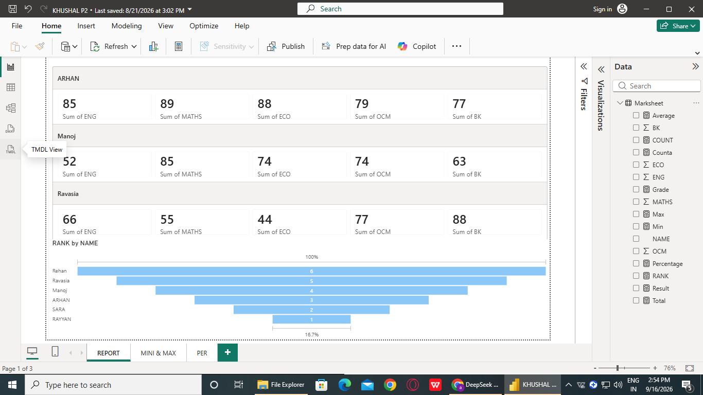
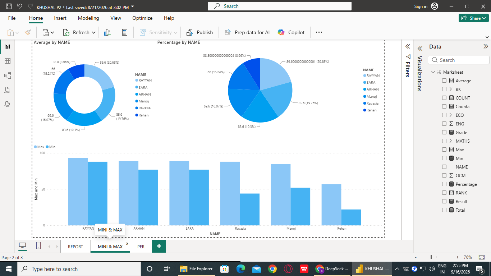
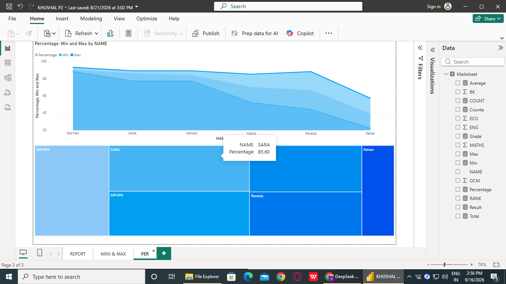
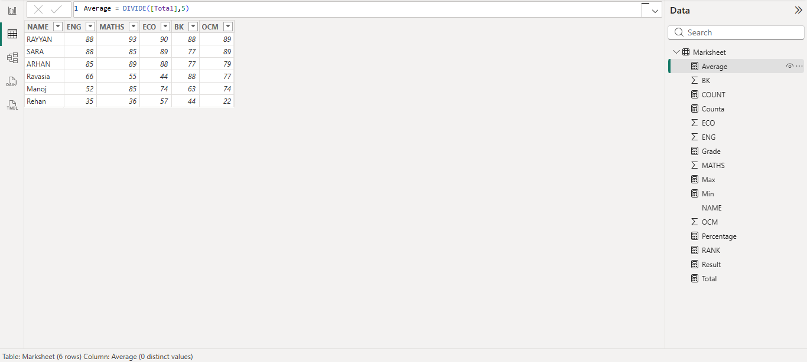

📊 Student Performance Dashboard - Microsoft Power BI


## 📖 Overview
This project is an interactive **Power BI Dashboard** designed to analyze and visualize student academic performance. It transforms raw marksheet data into actionable insights using dynamic DAX calculations and a variety of rich visualizations.

The dashboard provides a comprehensive view of student marks, percentages, rankings, and comparative analysis across different subjects.

## ✨ Key Features
*   **Dynamic DAX Measures:** Custom calculations for `Average`, `Percentage`, `Rank`, `Min`, and `Max` scores.
*   **Comprehensive Visualizations:** Utilizes Donut charts, Clustered Bar charts, Line charts, and Treemaps for multi-dimensional data analysis.
*   **KPI Cards:** Quick-glance metrics for Total, Average, and Percentage scores.
*   **Data Modeling:** Clean and structured data table for efficient querying and reporting.

## 📸 Dashboard Screenshots

### 1. Main Report View & Rankings
*Displays student-wise subject marks, overall rank, and subject-wise KPI cards.*


### 2. Percentage & Min/Max Analysis
*Visualizes the percentage distribution among students and compares their Minimum vs. Maximum scores.*


### 3. Trend & Distribution (Line & Treemap)
*Shows the trend of percentages across students and a treemap representation of student performance distribution.*


### 4. DAX Measures & Data Model
*Behind the scenes: The DAX formulas used to calculate the Average, Percentage, and other metrics.*


## 🛠️ Tech Stack & Tools
*   **Microsoft Power BI Desktop:** For data modeling, DAX, and visualization.
*   **DAX (Data Analysis Expressions):** For creating calculated columns and measures.
*   **Data Source:** Excel/CSV file (Marksheet).

## 🧮 Key DAX Formulas Used
Here are some of the core DAX formulas used in this project:

**1. Average Score:**
```dax
Average = DIVIDE([Total], 5)
Percentage = DIVIDE([Total], 500) * 100
